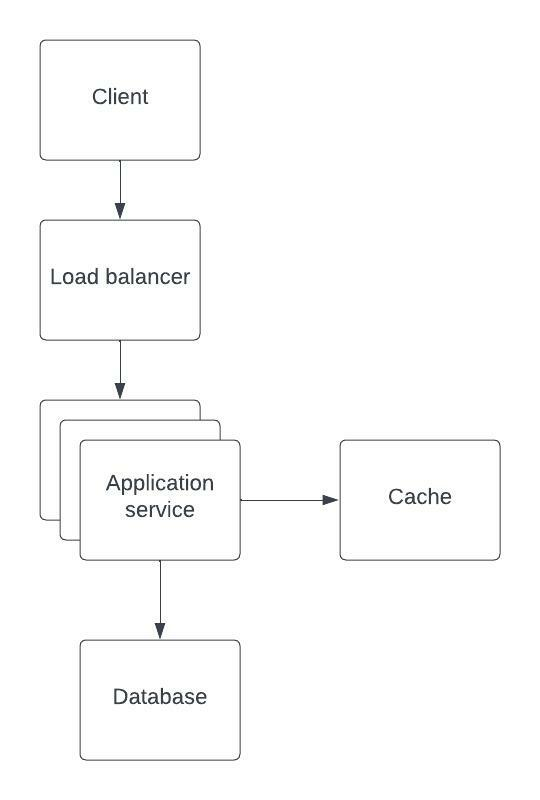

# Game mode web service

## Assumptions

* 10 game modes
* 20 regions
* 10 million concurrent players
* Game mode lasts on average 10 min 
* Game queries popular game modes when in lobby
* List of popular game modes should be up to date when querying 
* Game reports when entering or leaving game mode
* Players may unexpectedly quit or drop game

## Components

### Load balancer
* Load balancer distributing requests to application services

### Service

* Processes requests from game client
* Number of services scale based on load
* Exposes two API endpoints
* POST /api/v1/event 
    * Example request payload `{"user_id": 1, event_type="ENTER_GAME_MODE", "event_payload": {"game_mode": 1, "region": "US"}, "timestamp": current_time}`  
    * Example request payload `{"user_id": 1, event_type="LEAVE_GAME_MODE",  "event_payload": {"game_mode": 1, "region": "US"},"timestamp": current_time}`  
* GET /api/v1/popular_game_modes?region=region
    * Example response `{"region": "US", [{"game_mode": 1", "player_count": 2000}, {"game_mode": 2, "player_count": 1000}]}`

### Cache

* In memory cache (Redis or similar)
* Stores two key value structures
    * Player's current game mode: `key: user_id, value:region,game_mode`. Cache expiration: 1 hour (remove player from game mode count on expiration)
    * Game mode player count: `key:game_mode+region, value:count`. Cache expiration: infinite (manual flush) 

### Database   

* SQL database (Postgres or similar)
* Persisting for analytics or recreating cache after failure/restart 
* Table `event`
    * Creation and Reads
    * Columns `event_id PRIMARY KEY TEXT, user_id TEXT, event_type TEXT, event_payload JSONB, timestamp TIMESTAMP`

## Use case: Player enter game mode

* Game client sends request to `/api/v1/event` with event `ENTER_GAME_MODE` 
* Load balancer forward request to service
* Service check cache for players current play mode
    * If player in cache -> Replace cache with new player game mode. Decrement old game mode and increment new play mode.
    * If player not in cache -> Update cache with players game mode and increment game mode count
* Persist game mode event to database

## Use case: Player leaves game mode

* Game client sends request to `/api/v1/event` with event `LEAVE_GAME_MODE`
* Load balancer forward request to service
* Service check cache for players current play mode
    * If player in cache -> Remove player from game mode cache. Decrement old game mode.
* Persist game mode event to database

## Use case: Game client requests popular game modes

* Game client sends request to `/api/v1/popular_game_modes` for player region
* Load balancer forward request to service
* Service fetches player count from cache for region and returns sorted list